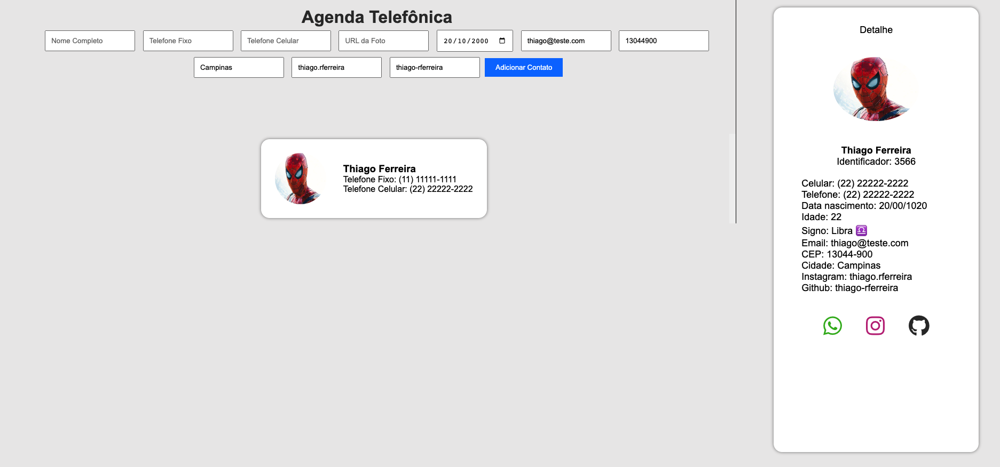

# Projeto-Agenda

# Aplicação de Gerenciamento de Contatos

Esta é uma aplicação de gerenciamento de contatos que permite adicionar, listar e visualizar detalhes de contatos. Ela inclui algumas funcionalidades interessantes, como cálculo do signo com base na data de nascimento e validação de campos de entrada.

## Classes

### `Contato`

A classe `Contato` representa um contato e possui os seguintes atributos:

- `fullname`: Nome completo do contato.
- `phone`: Número de telefone fixo.
- `cellphone`: Número de telefone celular.
- `photo`: URL da foto do contato.
- `id`: Identificador único gerado aleatoriamente.
- `birthdate`: Data de nascimento do contato.
- `email`: Endereço de email do contato.
- `cep`: CEP do contato.
- `city`: Cidade do contato.
- `signo`: Signo do zodíaco com base na data de nascimento.
- `age`: Idade calculada com base na data de nascimento.
- `insta`: Nome de usuário do Instagram do contato.
- `github`: Nome de usuário do GitHub do contato.

A classe também possui dois métodos:

- `getZodiacSign()`: Calcula e retorna o signo com base na data de nascimento.
- `calculateAge()`: Calcula e retorna a idade com base na data de nascimento.

### `ListaContatos`

A classe `ListaContatos` representa uma lista de contatos e possui um atributo `contatos`, que é um array para armazenar os contatos. Ela também possui três métodos:

- `adicionarContato(contato)`: Adiciona um novo contato à lista após a validação.
- `listarContatos()`: Retorna a lista de contatos.
- `getContactById(id)`: Retorna um contato com base no ID fornecido.

## Funções JavaScript

Além das classes, o código também inclui várias funções JavaScript:

- `adicionarContato()`: Lê os dados do formulário e cria um novo contato.
- `limparFormulario()`: Limpa os campos do formulário após a adição de um contato.
- `exibirContatos()`: Exibe a lista de contatos na interface do usuário.
- `isURLValida(url)`: Verifica se a URL da foto é válida.
- `clearInputs()`: Limpa todos os campos do formulário.
- `sendMSG(msg, type)`: Exibe uma mensagem na interface do usuário.
- `isAnyInputEmpty()`: Verifica se algum campo do formulário está vazio.
- `randomId()`: Gera um ID aleatório e verifica se já existe na lista de contatos.
- `checarIdExiste(id)`: Verifica se um ID já existe na lista de contatos.
- `gerarLinkWhatsapp(telefone)`: Gera um link para o WhatsApp com base no número de telefone.
- `gerarLinkInstagram(insta)`: Gera um link para o perfil do Instagram com base no nome de usuário.
- `gerarLinkGithub(github)`: Gera um link para o perfil do GitHub com base no nome de usuário.
- `contatoDetalhe(id)`: Exibe os detalhes de um contato específico.
- `exibirContatoDetalhe()`: Exibe os detalhes do contato na interface do usuário.
- `formateCelular(celular)`: Formata o número de celular.
- `formateCEP(cep)`: Formata o CEP.
- `formateDataPTBR(data)`: Formata a data no formato DD/MM.

## Uso

Para usar a aplicação, siga estes passos:

1. Abra o arquivo `index.html` em um navegador da web.
2. Preencha os campos do formulário na interface do usuário com as informações do contato que você deseja adicionar.
3. Clique no botão "Adicionar Contato" para adicionar o contato à lista.
4. A lista de contatos será exibida na interface, mostrando uma imagem do contato, seu nome e números de telefone.
5. Clique em um contato da lista para ver seus detalhes, incluindo links para WhatsApp, Instagram e GitHub.
6. Você também pode limpar todos os campos do formulário clicando no botão "Limpar Campos".

Lembre-se de que a aplicação inclui validações para garantir que os campos estejam preenchidos corretamente e que a URL da foto seja válida.

## Requisitos

A aplicação requer um navegador da web moderno para funcionar corretamente. Certifique-se de ter uma conexão com a Internet para carregar imagens de perfil dos contatos.

## Contribuição

Sinta-se à vontade para contribuir para este projeto aberto. Você pode adicionar novas funcionalidades, corrigir erros ou melhorar a interface do usuário. Basta enviar um pull request e seu código será revisado.

## Autor

Este projeto foi desenvolvido por Thiago Ferreira.
